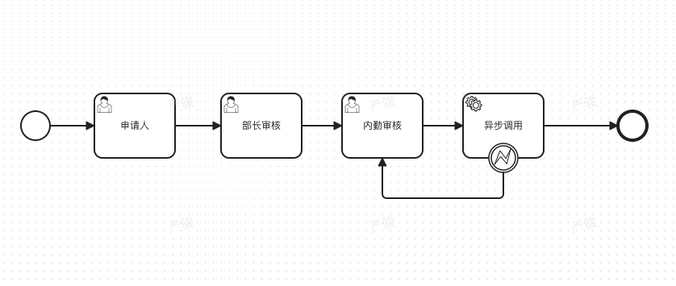
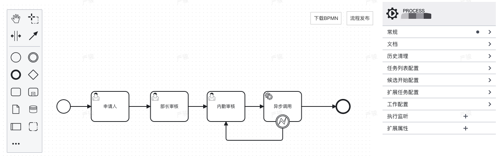

# embedded-bpmn-vue

Embedded bpmn modeling distributions based on [bpmn-js](https://github.com/bpmn-io/bpmn-js) and [camunda-bpmn-js](https://github.com/camunda/camunda-bpmn-js), default bpmn model type is Camunda. It can be applicable to Vue2.x, Vue3.x and Nuxt(ssr framework).

> Advantages
>
> - There is no need to consider Node versions, Vue versions, and Vue framework compatibility issues
> - Let the user focus on the process rather than the basic configuration
> - Support multiple languages (English, Chinese) to meet the needs of more users

## Installation

- via npm

```bash
$root npm install embedded-bpmn-vue
```

- via yarn

```bash
$root yarn add embedded-bpmn-vue
```

## Usage

This project is designed to deliver different BPMN modeling distributions. Instead of creating custom Modeler implementations based on [bpmn-js](https://github.com/bpmn-io/bpmn-js), choose one of the existing packages to mirror the modeling experience of [Camunda's modeling](https://github.com/camunda/camunda-modeler/) products.

### Global Config

```js
import Vue from 'vue'
import EmbeddedBpmnVue from 'embedded-bpmn-vue'

# options is optional
Vue.use(EmbeddedBpmnVue, {
  // optional
  version: '4.5.0',
  // optional
  locale: 'zh-cn'
})
```

**global options**
Option|Required|Type|Default|Description|
|---|:---:|---|:---:|---|
|version| false | string | '4.5.0' | camunda-bpmn-js tag versions |
| locale| false | string | 'en' | en/zh-cn|

### Global Components

#### Preview Component Usage

```html
<template>
  <div style="height: 400px; width: 100%; position: relative;">
    <cem-preview :xml-str="xmlStr" />
  </div>
</template>
<script>
  export default {
    data() {
      return {
        // camunda bpmn xml
        xmlStr: '',
      }
    },
  }
</script>
```

**Preview**



#### Dashboard Component Usage

```html
<template>
  <div style="height: 600px; width: 100%; position:relative;">
    <cem-dashboard :xml-str="xmlStr" @deploy="dashBoardDeploy"></cem-dashboard>
  </div>
</template>
<script>
  export default {
    data() {
      return {
        // camunda bpmn xml, default start event xml
        xmlStr: '',
      }
    },
    methods: {
      // deploy bpmn to server
      dashBoardDeploy({ xml, fileName }) {
        // TODO you need to invoke the server-side deploy API to implement the deployment functionality
        console.log('deploy xml:>>', xml)
        console.log('deploy xml file name:>>', fileName)
      },
    },
  }
</script>
```

**Preview**



**Dashboard Component Properties**
Property|Required|Type|Default|Description|
|---|:---:|---|:---:|---|
|xmlStr|false|String| '' | bpmn xml|
|bpmnFlag|false|Boolean| true | show dowload BPMN button |
|svgFlag|false|Boolean|false| show download SVG button|
|deployFlag|false|Boolean|false| show deploy button|
|minimapFlag|false|Boolean|false| show minimap button|

**Dashboard Component Methods**
Method|Params|Description|
|---|:---:|---|
|deploy|{xml, fileName}| deploy button callback function for custom deployment to yourself bpmn server-side|

## Related

camunda-bpmn-js builds on top of a few powerful tools:

- [camunda-bpmn-js](https://github.com/camunda/camunda-bpmn-js): View camunda-bpmn-js release versions
- [bpmn-js](https://github.com/bpmn-io/bpmn-js): View and edit BPMN 2.0 diagrams in the browser
- [diagram-js](https://github.com/bpmn-io/diagram-js): Diagram rendering and editing toolkit

## TODO

- bpmn workflow validation
- bpmn zoom operation
- bpmn redo operation
- bpmn undo operation
- embeded-bpmn-vue for 3.x

## License

MIT

Uses [bpmn-js](https://github.com/bpmn-io/bpmn-js) licensed under the bpmn.io license.
